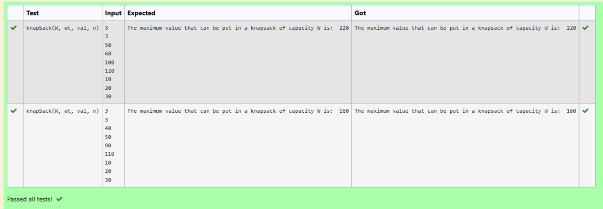

# EX 6B KNAPSACK PROBLEM

## DATE: 23-05-2025

## AIM:

To demonstrate a python program using dynamic programming for 0/1 knapsack problem.

## Algorithm

1. Create a DP table K[n+1][W+1], initialized to 0.
2. Iterate over items i from 0 to n and capacities w from 0 to W:
   If i == 0 or w == 0, set K[i][w] = 0 (base case).
   If current weight wt[i-1] ≤ w, set K[i][w] = max(val[i-1] + K[i-1]w - wt[i-1]], K[i-1][w]).
   Else, set K[i][w] = K[i-1][w].
3. Return K[n][W] as the maximum value.

## Program:

```python
# To implement the program for 0/1 knapsack problem.
# Developed by: Roopak C S
# Register Number: 212223220088

def knapSack(W, wt, val, n):
    K = [[0 for x in range(W + 1)] for x in range(n + 1)]
    for i in range(n + 1):
        for w in range(W + 1):
            if i == 0 or w == 0:
                K[i][w] = 0
            elif wt[i-1] <= w:
                K[i][w] = max(val[i-1]+ K[i-1][w-wt[i-1]],K[i-1][w])
            else:
                K[i][w] = K[i-1][w]

    return K[n][W]

x=int(input())
y=int(input())
W=int(input())
val=[]
wt=[]
for i in range(x):
    val.append(int(input()))
for y in range(y):
    wt.append(int(input()))

n = len(val)
print('The maximum value that can be put in a knapsack of capacity W is: ',knapSack(W, wt, val, n))
```

## Output:



## Result:

Thus the program was executed successfully for finding the maximum value that can be put in a knap sack of capacity .
