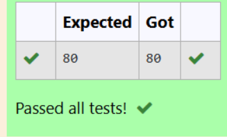

# EX 6C TRAVELLING SALES MAN PROBLEM

## DATE: 23-05-2025

## AIM:

To Solve Travelling Sales man Problem for the following graph.


## Algorithm

1. Initialize a list of all cities except the starting city s.
2. Generate all possible permutations of the remaining cities.
3. For each permutation:
   Set total path cost to 0.
   Starting from city s, add the cost to the next city in the permutation.
   After visiting all cities, return to the starting city and add that cost.
   4.Track the minimum of all such path costs.
4. Return the minimum cost found.

## Program:

```python
# To implement the program for TSP.
# Developed by: Roopak C S
# Register Number:  212223220088

from sys import maxsize
from itertools import permutations
V = 4

def travellingSalesmanProblem(graph, s):
    ##Write your code
    vertex = []
    for i in range(V):
        if i != s:
            vertex.append(i)
    min_path = maxsize
    next_permutation=permutations(vertex)
    for i in next_permutation:

        current_pathweight = 0
        k = s
        for j in i:
            current_pathweight += graph[k][j]
            k = j
        current_pathweight += graph[k][s]
        min_path = min(min_path, current_pathweight)

    return min_path

if __name__ == "__main__":
    graph = [[0, 10, 15, 20], [10, 0, 35, 25],
            [15, 35, 0, 30], [20, 25, 30, 0]]
    s = 0
    print(travellingSalesmanProblem(graph, s))
```

## Output:



## Result:

Thus the program was executed successfully for finding the minimum cost to vist all cities.
