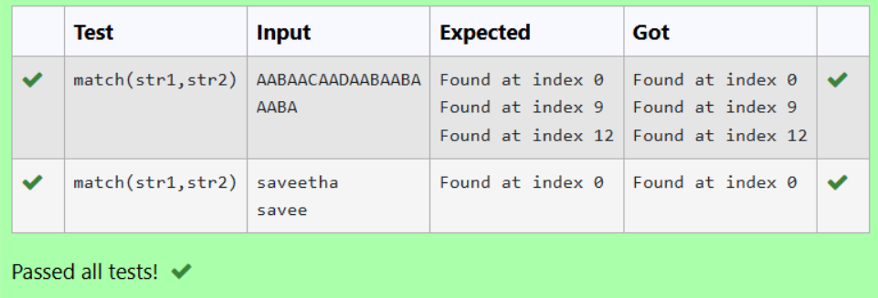

# EX 6D BRUTE FORCE ALGORITHM

## DATE: 23-05-2025

## AIM:

To write a python program using brute force method of searching for the given substring in the main string.

## Algorithm

1. Take two input strings: the main string and the substring to search.
2. Determine the lengths of both strings.
3. Loop from index 0 to len(main) - len(substring)
4. At each index, extract a substring of the same length as sub.
5. Compare it with the target sub.
6. If they match, print the starting index.

## Program:

```python
# To implement the program using brute force method of searching for the given substring in the main string.
# Developed by: Roopak C S
# Register Number: 212223220088

def match(string,sub):
    l = len(string)
    ls = len(sub)
    start = sub[0]
    for i in range(l-ls+1):
        if string[i:i+ls]==sub:
            print(f"Found at index {i}")

str1=input()
str2=input()
```

## Output:



## Result:

Thus the above program was executed successfully for searching the substring at respective index.
